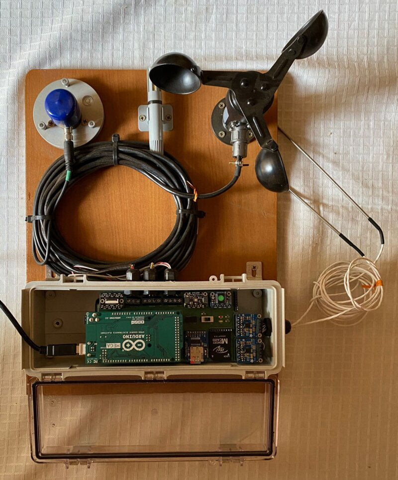
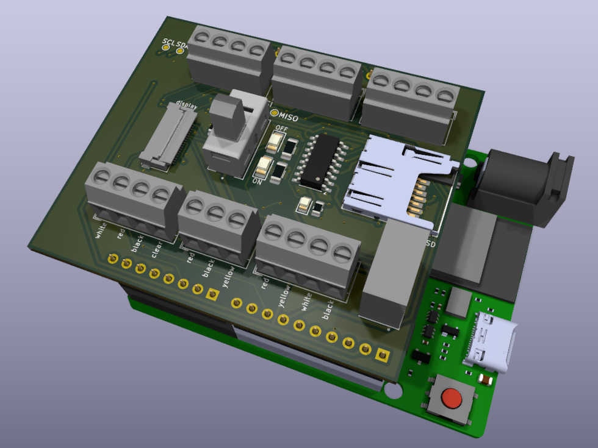
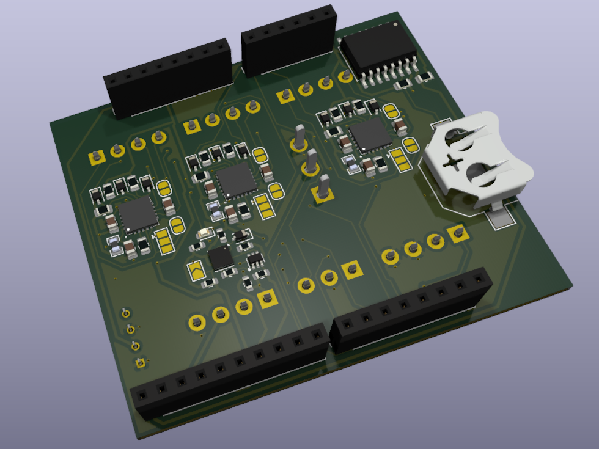

  
   

# Solar Cooker UHasselt

**Solar Cooker UHasselt** is part of the _Solar Cookers for All (SC4All)_ initiative, a collaboration between Hasselt University (Belgium) and the University of Lubumbashi (DRC), funded by VLIR-UOS.  
The project focuses on designing, prototyping, and locally manufacturing low-cost solar cookers for sustainable cooking solutions in resource-constrained communities.

This organization hosts the **source code and PCB designs for the solar cooker testing station in KiCad**, which measures cooking temperature (PT100), ambient conditions (temperature, humidity, wind), and solar irradiance. Key metrics are displayed on an LCD.

Supporting repositories for tools, experiments, and related hardware designs are also included, making this a central hub for the open-source development and testing of solar cooking technologies.

## Acknowledgments

This work would not have been possible without the contributions of **Ruben Godde, Kato Warson, and Jonas Meijerink**.

## Version 1 Testing Station

  

_Early prototype of the solar cooker testing station (Version 1), used for initial field experiments and validation of sensors and data acquisition._

## Version 2 Testing Station

<table>
  <tr>
    <td align="center">
       
      Top render with Arduino visible
    </td>
    <td align="center">
       
      Bottom render without Arduino for clarity
    </td>
  </tr>
</table>

_Version 2 prototype renders showing both top and bottom views of the solar cooker testing station._

## Repository Overview

### Main Repositories

- [**kicad-testing-station**](https://github.com/solar-cooker-UHasselt/kicad-testing-station): KiCad PCB for the solar cooker testing station: cooking temperature, weather and solar irradiance.
- [**arduino-code**](https://github.com/solar-cooker-UHasselt/arduino-code): PlatformIO firmware for the testing station: reads the sensors, logs to microSD, shows readings on an LCD.

### Prototypes Used in the Main Project

- [**kicad-adafruit-bme680**](https://github.com/solar-cooker-UHasselt/kicad-adafruit-bme680): KiCad port of the Adafruit BME680 breakout: temperature, humidity, pressure and gas sensor.
- [**kicad-adafruit-ds3231**](https://github.com/solar-cooker-UHasselt/kicad-adafruit-ds3231): KiCad port of the Adafruit DS3231 breakout: precision real-time clock.
- [**kicad-adafruit-max31865**](https://github.com/solar-cooker-UHasselt/kicad-adafruit-max31865): KiCad port of the Adafruit MAX31865 breakout: PT100 RTD temperature amplifier.
- [**kicad-adafruit-microsd**](https://github.com/solar-cooker-UHasselt/kicad-adafruit-microsd): KiCad port of the Adafruit microSD breakout board+: SPI card slot for data logging.

### Old or Supporting Repositories

- [**kicad-arduino-uno-r4-wifi**](https://github.com/solar-cooker-UHasselt/kicad-arduino-uno-r4-wifi): KiCad port of the Arduino UNO R4 WiFi, imported from Altium. Work in progress.
- [**kicad-testing-station-old**](https://github.com/solar-cooker-UHasselt/kicad-testing-station-old): Previous version of the testing station PCB, kept for reference.
- [**python-bom-script**](https://github.com/solar-cooker-UHasselt/python-bom-script): Adds Mouser and DigiKey price and stock to a KiCad BOM CSV.
- [**shiny-data-analysis**](https://github.com/solar-cooker-UHasselt/shiny-data-analysis): R Shiny app that analyses testing station measurements per ASAE S580.1.
